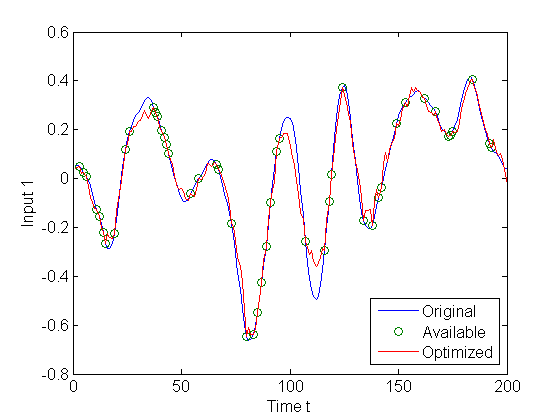
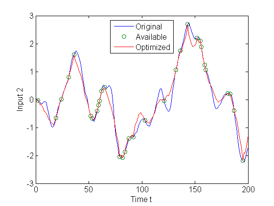
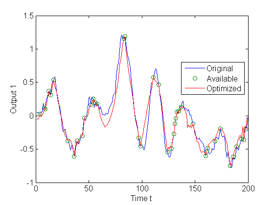
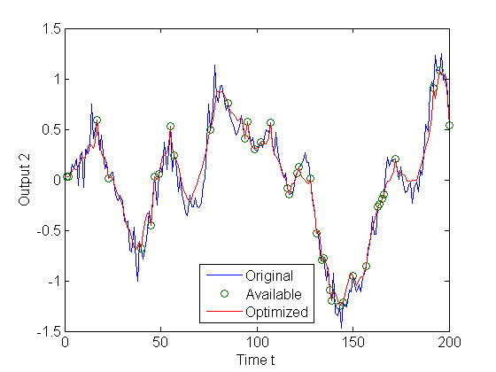

# SIMIO: a MATLAB package for system identification with missing inputs and outputs.

Copyright (c) 2013 Zhang Liu, Anders Hansson, and Lieven Vandenberghe.

## Introduction

SIMIO is a Matlab package for solving system identification problems with missing inputs and outputs. The approach of recovering the missing inputs and outputs is based on the nuclear norm optimization of a subspace system identification formulation. The optimization is solved using the alternating direction method of multipliers (ADMM). Details of the algorithm are described in the paper "Nuclear norm system identification with missing inputs and outputs" by Z. Liu, A. Hansson, and L. Vandenberghe.

## Download

The SIMIO repository contains the system identification routines and example files. The examples in the SIMIO package require MATLAB's System Identification Toolbox.

## User Guide
SIMIO contains two main system identification functions. 

#### optimize_missing_yu.m

This function computes a sequence of optimized inputs and outputs from
the regularized nuclear norm optimization

    minimize |[U;Y]|_* + lambda/2 * |y-y_meas|_F^2,

where U and Y are block Hankel matrices constructed from the inputs
and outputs.  The inputs and outputs can be partially missing.
An example is provided in the file optimize_missing_yu_example.m.

The figures below illustrate the results for the compact disc arm data of the DaISy data collection. The system has two inputs and two outputs. The circles in the figures indicate the available data points for system identification. The red lines in the figures show the optimized inputs and outputs returned by the optimize_missing_yu function, which can then be used by a standard system identification routine, e.g., Matlab's n4sid.

  
  

  
  

#### optimize_y.m

This function computes a sequence of optimized outputs from the
regularized, weighted nuclear norm optimization

    minimize |W1*Y*U^perp*Phi^T*W2|_* + lambda/2 * |y-y_meas|_F^2,

where the weighting matrices W1 and W2 are based on variants of the
standard subspace formulation (MOESP, N4SID, IVM, and CVA).  The
weighting matrices make solving the optimization particular slow, so
the FFT technique is used to speed up the computation. The inputs
and outputs in this case need to be complete.  An example is
provided in the file optimize_y_example.m.

## Feedback
We welcome and appreciate any comments, suggestions, and reports of applications of SIMIO. Please send feedback to Zhang Liu (zhang.liu@gmail.com), Anders Hansson (hansson@isy.liu.se) or Lieven Vandenberghe (vandenbe@ee.ucla.edu).
